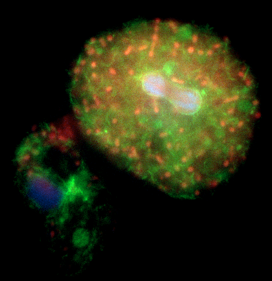
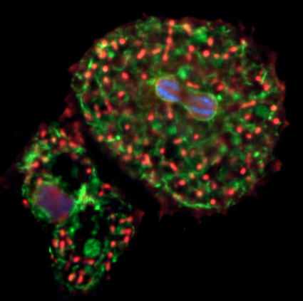

# Dataset — Baukje

[← Back to the main README](../readme.md)

Multi-channel widefield fluorescence of a ***Dictyostelium*** sample
(Concanavalin A / ConA), acquired on the same Zeiss system as the
[Paula dataset](paula.md) and saved as raw **CZI**. The key difference is a
**finer axial sampling** (Z step = 330 nm instead of 500 nm).

Data folder: `…\deconvolution-workflow\baukje\20251201_dicty_conA\`
(`raw\`, `deconvolved\`, `psf.tif`). 12 acquisitions, `CryoGA-01 … CryoGA-12`.

---

## Optics & detector

Same objective and optics as the [Paula dataset](paula.md):

| Property           | Value                                              |
|--------------------|----------------------------------------------------|
| Objective          | LD C-Apochromat 40x/1.1 W Korr UV VIS IR           |
| Immersion          | Water                                              |
| NA                 | 1.1                                                |
| Nominal mag.       | 40×                                                |
| Working distance   | 600 µm                                             |
| Acquisition mode   | Widefield / Epifluorescence                        |

## Voxel size

| Axis      | Size    |
|-----------|---------|
| XY pixel  | 162 nm  |
| Z step    | **330 nm** |

## Channels

Four channels: **Green**, **Red**, **Blue**, **Far-red**.

---

## Theoretical PSF

Generated with the [PSF Generator](https://bigwww.epfl.ch/algorithms/psfgenerator/)
Fiji plugin, **Born & Wolf 3D** optical model — **identical parameters to the
[Paula PSF](paula.md#theoretical-psf) except for the Z step**, which is set to
**330 nm** to match this acquisition's axial sampling.

| Parameter                     | Value                     |
|-------------------------------|---------------------------|
| Optical model                 | Born & Wolf 3D            |
| Refractive index (immersion)  | 1.33 (water)              |
| Wavelength                    | 610 nm                    |
| Numerical aperture (NA)       | 1.1                       |
| Pixel size XY                 | 162 nm                    |
| Z step                        | **330 nm**                |

Because only the axial sampling differs, the physical resolution is unchanged
(FWHM XY ≈ 338 nm, FWHM Z ≈ 1008 nm); the finer Z step simply samples the same
PSF more densely along the optical axis.

PSF file: `20251201_dicty_conA\psf.tif`.

---

## Deconvolution settings

Same standard workflow settings as the [Paula dataset](paula.md) (see the
[main README](../readme.md#deconvolution)):

- Richardson–Lucy (CLIJ2, GPU), **120 iterations**, **no regularization**
- PSF: the theoretical 330 nm-Z-step PSF above
- Output resaved as OME-TIFF in `20251201_dicty_conA\deconvolved\`

---

## Results — Z projection (lateral view)

| Raw | Deconvolved |
|-----|-------------|
|  |  |

The axial cross-section comparison is shown in the
[main README](../readme.md#why-deconvolution--axial-cross-section).
