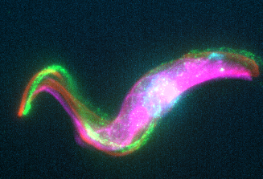
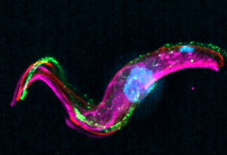

# Dataset — Paula

[← Back to the main README](../readme.md)

4-channel widefield fluorescence, acquired on a Zeiss system and saved as raw
**CZI**. This is the dataset used to develop the workflow. Acquisition metadata
below is extracted from the CZI.

Data folder: `…\deconvolution-workflow\paula\` (`raw\`, `deconvolved\`, `crop\`).

---

## Optics & detector

| Property           | Value                                              |
|--------------------|----------------------------------------------------|
| Objective          | LD C-Apochromat 40x/1.1 W Korr UV VIS IR           |
| Immersion          | Water                                              |
| NA                 | 1.1                                                |
| Nominal mag.       | 40×                                                |
| Working distance   | 600 µm                                             |
| Detector           | Hamamatsu camera (1× camera adapter)               |
| Acquisition mode   | Widefield / Epifluorescence                        |

## Voxel size

| Axis      | Size    |
|-----------|---------|
| XY pixel  | 162 nm  |
| Z step    | 500 nm  |

## Channels

| Channel  | Fluor           | Excitation | Emission |
|----------|-----------------|-----------:|---------:|
| 0:0      | Alexa Fluor 647 | 650 nm     | 671 nm   |
| 0:1      | Alexa Fluor 568 | 579 nm     | 603 nm   |
| 0:2      | Alexa Fluor 488 | 499 nm     | 520 nm   |
| 0:3      | DAPI            | 351 nm     | 464 nm   |

---

## Theoretical PSF

Generated with the [PSF Generator](https://bigwww.epfl.ch/algorithms/psfgenerator/)
Fiji plugin, **Born & Wolf 3D** optical model.

### Parameters used

| Parameter                     | Value                     |
|-------------------------------|---------------------------|
| Optical model                 | Born & Wolf 3D            |
| Refractive index (immersion)  | 1.33 (water)              |
| Accuracy                      | Good                      |
| Wavelength                    | 610 nm                    |
| Numerical aperture (NA)       | 1.1                       |
| Pixel size XY                 | 162 nm                    |
| Z step                        | 500 nm                    |
| Output size (X × Y × Z)       | 256 × 256 × 65            |
| Output type / display         | 32-bit, Linear, Fire LUT  |

Resulting theoretical resolution (reported by the plugin):

| Metric   | Value     |
|----------|-----------|
| FWHM XY  | 338.3 nm  |
| FWHM Z   | 1008.3 nm |

> The immersion refractive index (1.33) matches the water-immersion objective,
> and the NA / voxel size match the acquisition. A single representative
> emission wavelength (**610 nm**) was used to generate **one** PSF applied to
> all channels.

---

## Deconvolution settings

Standard workflow settings (see the [main README](../readme.md#deconvolution)):

- Richardson–Lucy (CLIJ2, GPU), **120 iterations**, **no regularization**
- PSF: the theoretical PSF above (`deconvolved\PSF.tif`)

---

## Results — Z projection (lateral view)

| Raw | Deconvolved |
|-----|-------------|
|  |  |

The axial cross-section comparison is shown in the
[main README](../readme.md#why-deconvolution--axial-cross-section).
