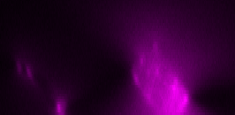
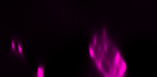
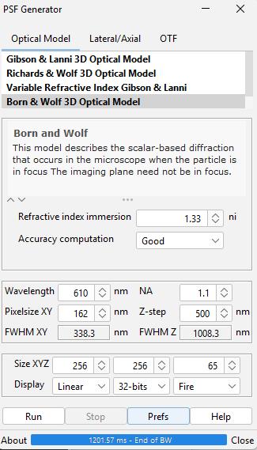

# BDV-Playground Deconvolution

Tiled, lazy, multi-GPU Richardson–Lucy deconvolution for large **5D** microscopy
images (XYZ + channels + timepoints), in Python.

```
pip install bdv-playground-deconvolution   # import bdvpg_deconvolution
```

It handles images far bigger than GPU memory by working **tiled** and **lazily**:
each volume is split into overlapping blocks, each block is deconvolved on the
GPU, and nothing is computed until you actually browse or export the result.
Multiple GPUs (or several contexts on one GPU) can be used in parallel.

All channels and timepoints are processed and written out by default, in the
original order, using a single PSF.

Under the hood it drives [BigDataViewer-Playground](https://bigdataviewer-playground-documentation.readthedocs.io/en/latest/processing_images/deconvolution.html)
and CLIJ2 through [PyImageJ](https://github.com/imagej/pyimagej) — the numerics
are the well-tested BIOP/ImageJ implementation, not a reimplementation. Python
is the orchestration layer.

## Why deconvolution

The axial (Z) view is where widefield blur is worst and where deconvolution
helps most:

| Raw | Deconvolved |
|-----|-------------|
|  |  |

## Install

```bash
uv sync                      # core
uv sync --extra notebook     # + JupyterLab
```

**No conda required, and you do not need to install Java or Maven yourself.**
`scyjava`/`jgo` provision both automatically via
[`cjdk`](https://pypi.org/project/cjdk) on first use, into a user-level cache
(`%LOCALAPPDATA%\cjdk` on Windows, `~/.cache/cjdk` elsewhere).

The only real prerequisite is an **OpenCL-capable GPU** with vendor drivers
installed — that part is not pip-installable.

> **First run is heavy.** Installing is a few MB, but the first *run* downloads
> a JDK (~190 MB), Maven, and the ImageJ2/BIOP Maven tree — several hundred MB,
> once, then cached. It needs `maven.scijava.org` reachable.

Verify your setup without a GPU or any data:

```bash
uv run python smoke_test.py    # boots the JVM, resolves every Java class used
```

## Quick start (CLI)

Headless and save-only — the intended batch / pipeline interface:

```bash
uv run bdvpg-deconvolve \
  --image  /path/to/image.czi \
  --psf    /path/to/psf.tif \
  --out    /path/to/output_folder \
  --iterations 120 \
  --threads 10
```

Writes `<image>.ome.tiff` to the output folder, preserving channel order.
`bdvpg-deconvolve --help` lists every option.

## Notebook

```bash
uv run jupyter lab
```

Open [`notebooks/Deconvolve.ipynb`](notebooks/Deconvolve.ipynb) for interactive
parameter tuning and viewing raw + deconvolved side by side in BigDataViewer.
Use `mode="interactive"` (needs a display).

## Library

```python
from bdvpg_deconvolution import DeconvolveParams, init_imagej, run

ij = init_imagej(mode="headless", max_heap="32g")
run(DeconvolveParams(
    image_file="image.czi",
    psf_file="psf.tif",
    output_folder="out/",
    num_iterations=120,
), ij=ij)
```

A JVM starts **once per process**, so `init_imagej()` must be called before any
work and its `mode` cannot change afterwards.

## Point Spread Function

One **single-channel PSF** is supplied per image and reused for all channels.
If no empirical PSF (e.g. from sub-resolution beads) is available, a theoretical
one can be generated with the
[PSF Generator](https://bigwww.epfl.ch/algorithms/psfgenerator/) Fiji plugin
using the Born & Wolf 3D optical model — match its Z step to your acquisition's
axial sampling.



## Parameters

| Flag | Default | Notes |
|------|---------|-------|
| `--iterations` | 120 | Richardson–Lucy steps |
| `--regularization` | 0.0 | 0 = none; increase to tame noise/ringing |
| `--no-non-circulant` | (on) | disable non-circulant edge handling |
| `--block-size-x/y/z` | 256/256/64 | tiling — lower if you run out of GPU memory |
| `--overlap-size` | 16 | tile overlap, avoids seams |
| `--threads` | 10 | CPU-side workers feeding the GPU pool |
| `--output-pixel-type` | keep original | or `Float` |
| `--compression` | LZW | OME-TIFF compression |
| `--resolution-levels` | 1 | OME-TIFF pyramid levels |
| `--unit` | MICROMETER | coordinate unit |
| `--overwrite` | off | refuse to clobber existing output unless set |
| `--mode` | headless | escape hatch if a command misbehaves headless |
| `--max-heap` | — | JVM heap, e.g. `32g` |

The CLI is **save-only** by design — it deconvolves and writes an OME-TIFF.
Viewing results is the notebook's job: a CLI process exits as soon as the work
is done, which tears down the JVM and any BigDataViewer window with it.

## Multi-GPU configuration

By default deconvolution runs on a single GPU (device `0`). The device pool is
configured through ImageJ preferences — a `Pool Configuration` string of the
form `device_idx:n_workers, device_idx:n_workers`. For example `0:2, 1:4` runs
2 contexts on GPU 0 and 4 on GPU 1, i.e. **6 GPU workers**. It persists in the
ImageJ preferences and applies to subsequent runs.

> **Pool workers vs `--threads`.** The pool config sets the number of **GPU-side**
> workers. `--threads` is the number of **CPU-side** workers feeding that pool
> (load, convert, hand to GPU, retrieve, write). Keep `--threads` a bit higher
> than the total GPU workers so the GPUs are never left waiting.

## Nextflow

The CLI is the intended Nextflow interface — one image per task, headless:

```groovy
process deconvolve {
    input:
      tuple val(sample), path(image), path(psf)
    output:
      path "${image.baseName}.ome.tiff"
    script:
      """
      bdvpg-deconvolve --image ${image} --psf ${psf} --out . \\
                 --iterations ${params.iterations} --threads ${params.threads}
      """
}
```

One JVM boots per invocation, so one-image-per-task is the right granularity.
For reproducible runs, containerise with the OpenCL runtime, a pre-warmed cjdk
cache, and a pre-resolved `.jgo` env so tasks don't each re-download.

## Reproducibility

Two package managers are in play. `uv.lock` pins the Python side; the Java side
is pinned by the coordinates in
[`bdvpg_deconvolution/pipeline.py`](bdvpg_deconvolution/pipeline.py):

```python
DEFAULT_ENDPOINTS = [
    "net.imagej:imagej:2.16.0",
    "ch.epfl.biop:bigdataviewer-biop-tools:0.21.0",
]
```

Bump those and cut a release when you want to move the Java side.

The JVM itself is *not* pinned by default — cjdk prefers a suitable system JDK
and downloads one otherwise. To pin it, before the first `init_imagej()`:

```python
from scyjava import config
config.set_java_constraints(fetch="always", vendor="zulu", version="21")
```

## Status

The pipeline is a faithful transcription of a production Fiji/Groovy workflow,
and the interop layer is verified (`smoke_test.py` passes: JVM boots, all Java
classes and the `SourceService` resolve). A full GPU run has **not** been
exercised end-to-end here — validate against a known dataset first.

Not yet implemented:

- `--check-gpu` — enumerate OpenCL devices and fail early with a readable
  message instead of a CLIJ stack trace mid-run.
- `--prefetch` — warm the JDK/Maven/jgo caches ahead of first use.

## Credits

Built on the BigDataViewer-Playground / Kheops / CLIJ2 stack from
**BIOP — EPFL**. Original Fiji Groovy implementation and this Python port by
Nicolas Chiaruttini. Free to reuse.

The lab-specific version this was generalised from — including the original
`Deconvolve.groovy` and per-dataset notes — is preserved on the
`specific-use-cases` branch.
